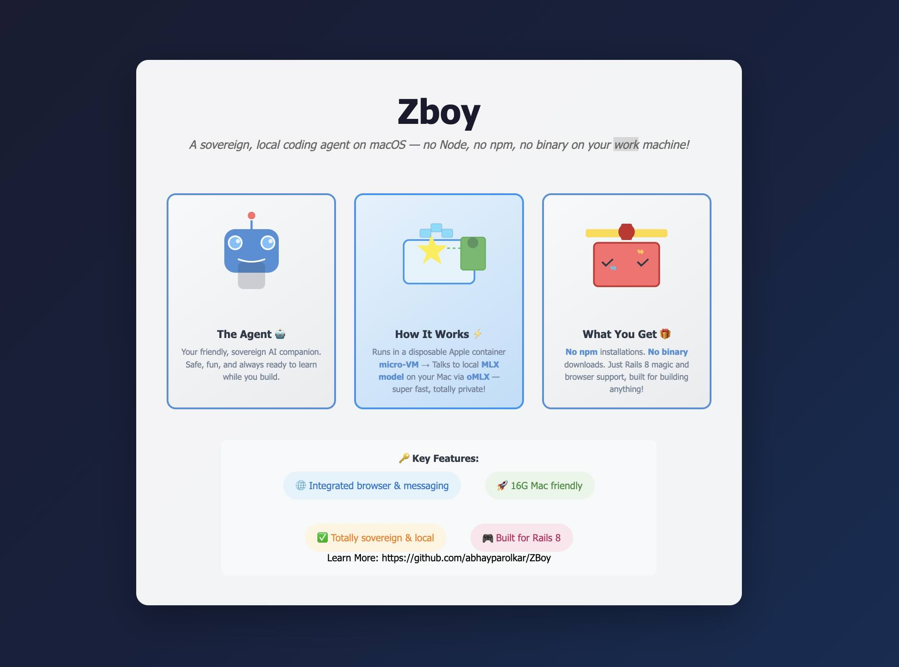

<p align="center">
  
</p>

<h1 align="center">pi-container</h1>

<p align="center">
  <strong>A sovereign, local coding agent on macOS.</strong><br>
  The <code>pi</code> coding agent runs in a disposable Apple <code>container</code> micro-VM and talks to a local
  MLX model on the host via <strong>oMLX</strong> — no Node, no npm, no agent binary on your work machine.
</p>

<p align="center">
  
  
  
  
  
  
  
</p>

---

## Overview

A modern coding agent reads your files, runs shell commands, and installs whatever it decides it needs. On a work machine in a regulated context that is an unacceptable blast radius. This repository contains a **runnable setup** that closes it:

- **Inference stays native on the host** — MLX needs Apple Silicon's Metal/ANE, which a Linux VM does not expose. The default model is **MLX-Qwen3.5-9B-GLM5.1-Distill-v1-6bit**, served locally via **oMLX**.
- **The agent runtime is sandboxed in its own VM** — Apple `container` gives each container a lightweight VM, not shared-kernel namespaces.
- **The host stays clean** — no Node, no npm, no `pi` binary; the agent lives only inside an image and is discarded on exit.

The full step-by-step walkthrough is the article **[`en-pi-apple-container.md`](en-pi-apple-container.md)**.

## Architecture

```
┌─────────────────────────────┐        ┌──────────────────────────────┐
│ Host (macOS, Apple Silicon) │        │ Apple Container (Linux VM)   │
│                             │        │                              │
│  oMLX server                │◄──────►│  pi-coding-agent             │
│  /v1/chat/completions       │ Bridge │  (Node 22, ripgrep, git,     │
│  MLX-Qwen3.5-9B-GLM5.1-     │        │   Ruby, Rails, ffmpeg,       │
│    Distill-v1-6bit          │        │   SQLite)                    │
└─────────────────────────────┘        │  Workspace: /workspace       │
                                      └──────────────────────────────┘
```

- **Inference** runs on the host via oMLX (no Metal/ANE in a Linux VM).
- **Tool-calling sandbox** runs in the container — a clean split between model runtime and agent runtime.
- **pi** reaches the host only over the container bridge; the gateway IP is discovered at runtime.

## Repository structure

```
.
├── Containerfile                   # node:22-bookworm-slim + pi, Ruby, Rails, ffmpeg, SQLite
├── pi-config/
│   ├── AGENTS.md                   # global agent rules (container variant)
│   ├── models.json                 # provider + model definition (oMLX)
│   ├── settings.json               # pi runtime settings
│   └── extensions/
│       └── protected-paths/
│           └── index.ts            # tool-call guardrail for sensitive paths
└── scripts/
    ├── build.sh                    # container build
    └── run.sh                      # container run with the right mounts
```

`pi-config/` is mounted into the container at runtime as the agent's config directory.

## Prerequisites

- **macOS 26 (Tahoe) on Apple Silicon** (recommended). Container-to-host networking is the linchpin; older macOS limits it severely.
- Apple `container` CLI (`container --version` must answer).
- **oMLX** running on the host, serving an OpenAI-compatible `/v1/chat/completions` endpoint bound to `0.0.0.0` (not `127.0.0.1`). The default model is `MLX-Qwen3.5-9B-GLM5.1-Distill-v1-6bit`.
- **No Node and no npm on the host** — that is the point; the agent lives only in the image.

## Quickstart

### 1. Build

```bash
./scripts/build.sh
```

### 2. Find the bridge IP

```bash
container run --rm --entrypoint sh pi-coding-agent:local \
  -c "ip route | awk '/default/ {print \$3}'"
```

Update `baseUrl` in `pi-config/models.json` if the printed IP differs (keep the `:8888/v1` suffix).

### 3. Run

```bash
PROJECT_DIR=~/projects/your-repo ./scripts/run.sh
```

That's it. `run.sh` mounts `pi-config/` → agent config and `$PROJECT_DIR` → `/workspace`. The VM is discarded on exit.

## Configuration

### Models — `pi-config/models.json`

Defines the `mlx-local` provider pointing at the oMLX server. `apiKey` is `"not-required"` (local server, no secret to leak). The model `id` must match exactly what oMLX reports — currently **`MLX-Qwen3.5-9B-GLM5.1-Distill-v1-6bit`**.

### Global agent rules — `pi-config/AGENTS.md`

Loaded into every session: runs in a container, host not directly reachable, file ops only in `/workspace`, no external calls without explicit instruction, and tool discipline (`read` before `edit`, `write` only for new files).

### Extension — `protected-paths`

Hooks pi's `tool_call` event and forces confirmation (or hard-denies) for sensitive paths (`~/.ssh`, `~/.aws`, `.env`, `credentials.json`, `*.pem`, etc.). Defense-in-depth for the day someone widens a mount.

## Troubleshooting

| Symptom | Cause & fix |
|---|---|
| Requests hang, no error | **Local Network permission not granted.** *System Settings → Privacy & Security → Local Network* — enable the container runtime, then reopen. |
| "Can't reach the model" | **oMLX bound to loopback.** Bind to `0.0.0.0`. |
| Connection refused | **Wrong bridge IP.** Re-run step 2 and update `models.json`. |
| Files owned by UID 1000 | **Expected.** Container writes as `pi` (UID 1000). Acceptable in the pi edit-workflow. |
| Agent answers but never edits | **No native tool-calling.** Verify the model supports OpenAI function-calling. |

## Notes & caveats

- **MLX stays on the host.** No Metal/ANE inside a Linux VM.
- **Bridge IP is environment-dependent** — discovered at runtime, never hardcoded.
- **API keys are never committed.** `models.json` uses `"not-required"` for local oMLX servers.

## License

Licensed under the MIT License — see [`LICENSE`](LICENSE).
